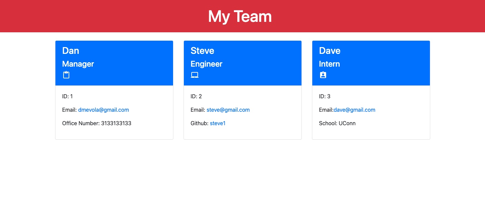

# Know Your Team 

## Description
**Know Your Team** is a node application that allows you to quickly create a team profile webpage by answering a series of prompts. It features Object Oriented Programming and Test Driven Development.

*Here is a screenshot*

## Technologies Used
This application is built with **Node.js**, **Inquirer** for question prompts, **Jest** for testing, **Bootstrap** for CSS, and **Google Fonts** for fonts and Icons. 

## Walkthrough
You can watch a walkthrough of the applications functionality [here](https://drive.google.com/file/d/1qhlmntYV-IO1TvML9UWEmD9jCegEVc76/view)

## Contact
This application was built by [Dan Evola](https://dmevola.github.io/portfolio/). You can find more projects on [github](https://github.com/dmevola/)